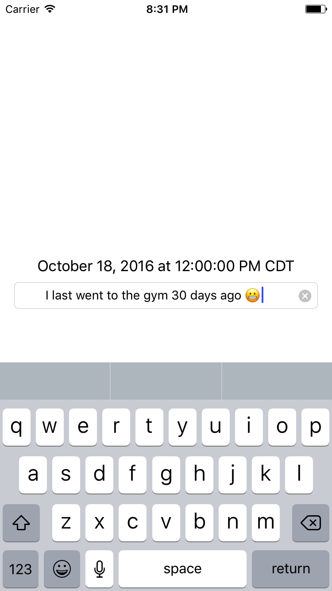
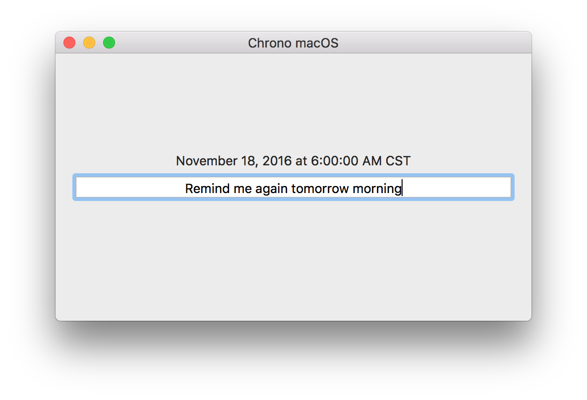
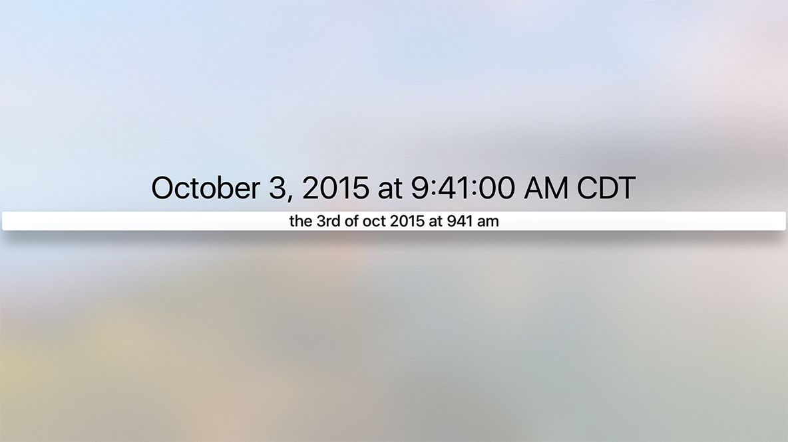

# chrono-swift

chrono-swift is a Swift wrapper for [Wanasit Tanakitrungruang's excellent chrono.js natural language date parser](https://github.com/wanasit/chrono "chrono.js"). chrono-swift lets you use chrono.js for your iOS, macOS, or tvOS apps, all while working with native Swift and Foundation data types. No need to deal with any of JavaScript's silliness.

chrono-swift, (referred to as "Chrono" from here onwards), extracts date information from natural language phrases like **"Remind me in 2 days"** or **"Meet me this Saturday from 3-4 PM"** and returns Swift `Date` or `DateInterval` values.

# Setup

Just add the "Chrono" folder located at the root of the repo to your Xcode project. 

# Usage

Using Chrono is easy. First, create an instance of the `Chrono` singleton:

```swift
let chrono = Chrono.shared
```

### Extract Date

To extract a date from a natural language phrase, simply pass in the phrase to `Chrono`'s `dateFrom(naturalLanguageString:)` method.

```swift
let date = chrono.dateFrom(naturalLanguageString: "Remind me in 2 days")
// If today is November 17th, 2016, `date` will be November 19th, 2016
```

### Extract Date Interval

To extract a date interval from a natural language phrase, pass in the phrase to `Chrono`'s `dateIntervalFrom(naturalLanguageString:)` method.

```swift
let dateInterval = chrono.dateIntervalFrom(naturalLanguageString: "Meet me this Saturday from 3-4 PM")
// If today is November 17th, 2016, `dateInterval` will be November 19th, 2016 3:00 PM - November 19th, 2016 4:00 PM
```

### Detailed Parsed Results

You can also get more detailed parsed results using `Chrono`'s `parsedResultsFrom(naturalLanguageString:)` method.

```swift
let result = chrono.parsedResultsFrom(naturalLanguageString: "I have an appointment tomorrow from 10 to 11 AM")
print(results)
```

`result` will be a special struct of type `ChronoParsedResult`. This struct contains several member variables that describe the parsed result. In this case, the struct will look like this:

```
inputString: I have an appointment tomorrow from 10 to 11 AM
indexOfStartingCharacterOfTimePhrase: 22
timePhrase: tomorrow from 10 to 11 AM
ignoredText: I have an appointment 
referenceDate: November 17, 2016 at 8:18:14 PM CST
startDate: November 18, 2016 at 10:00:00 AM CST
endDate: November 18, 2016 at 11:00:00 AM CST
dateInterval: November 18, 2016, 10:00:00 AM CST - 11:00:00 AM CST
```

# Sample Project

Under the "Sample Apps" folder is a sample Xcode project with iOS, macOS, and tvOS targets. 






